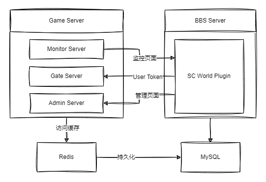

- Feature Name: Framework Building 架构搭建
- Start Date: 2023-03-06
- Status: `await`
- Type: `structure`
- Project issue: 无
- Dev PR: 无

# Summary - 概要
[summary]: #summary

本文档将阐述整个游戏前后端的架构体系。

# Feature description - 功能说明
[feature-description]: #feature-description

星际世界 整体架构如下图

游戏分为三个部分：论坛插件、游戏服务器、游戏前端。

在具体分配上，游戏前端和论坛插件部分存在于同一个 git repo。

用户在方问 BBS 的相关页面时，通过 ws 将用户认证信息传递给游戏后端服务器，通过 Gate Server 验证完成后，则完成登录过程。之后通过 Connector Server 和游戏后端连接。

论坛插件的后台页面提供相应的管理模块，通过 ws 链接游戏服务器的 Monitor Server 和 Admin Server 完成整个游戏服务器的监控与管理。论坛插件的设置界面配置游戏服务器的数据库信息。论坛和游戏使用同一个数据库。

对于游戏前端部分，我们采用 HTML5 相关的技术开发。通过 WebSocket 和后端服务器通信，利用 Service Worker 来实现前端数据缓存。

# Implementation description - 实现说明
[implementation-description]: #implementation-description

- Game Server 使用 Pinus 框架来实现
- 缓存使用 Redis
- 监控和管理页面通过 WebSocket 和 Game Server 的对应子 Server 连接
- 游戏前端部分采用 Pixi.js 来开发

# Prior module - 现有模块
[prior-module]: #prior-module

无

# Resource request - 资源请求
[resource-request]: #resource-request

无
